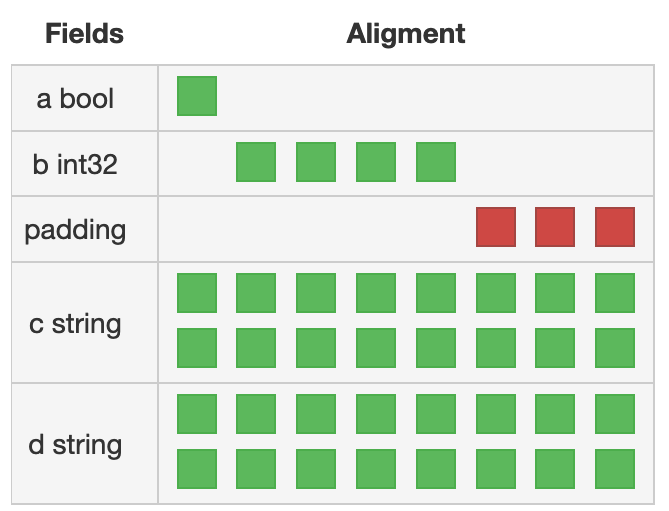
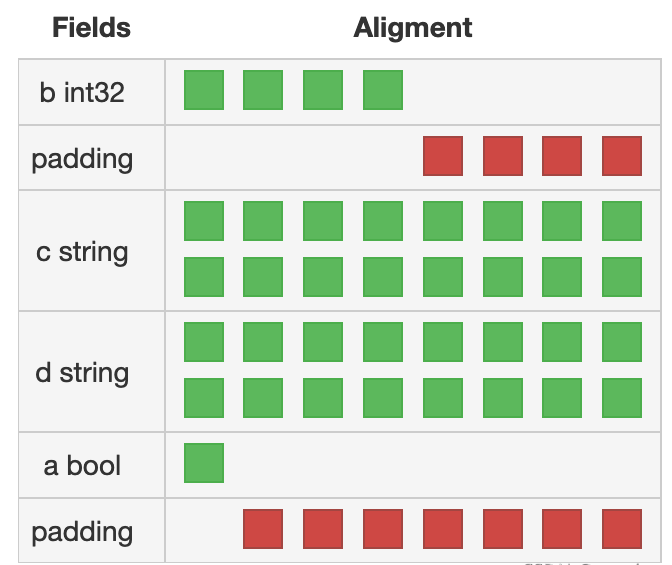

# 前言
基本数据类型介绍完，第四章就到复合类型。复合类型是一种聚合结构，聚合的是基本数据类型。包括，数组，切片，map 和结构体等。

下面逐个介绍复合类型。

# 数组
数组有一点需要注意的是，数组的相等性是数组中元素相等，而不是地址相等。

# 切片

**切片比较**  
Go 中原生切片是不可比较的。主要原因之一是，切片指向的是底层数组，在运行时底层数组的指向如果变化，则比较将是无效的。

如果需要比较切片，则需要手动写代码比较切片指向的底层数组的相等性。示例代码如下：
```
func compare(s1, s2 []int) bool {
	if s1 == nil || s2 == nil {
		return false
	}

	if len(s1) == 0 && len(s2) == 0 {
		return true
	}

	if len(s1) != len(s2) {
		return false
	}

	for i, j := 0, 0; i < len(s1); i++ {
		if s1[i] == s2[j] {
			j++
		} else {
			return false
		}
	}

	return true
}
```

**nil 和空切片**  
切片是引用类型，在实际使用时需注意 nil 和空的区别。对于切片，nil 是切片指针“无指向”，空切片的切片指针是有指向的。示例代码如下：
```
c := []rune{}
if c == nil {
    fmt.Printf("nil slice %T %v\n", c, c)
} else {
    fmt.Printf("empty slice %T %v %d\n", c, c, len(c))
}

var d []rune
if d == nil {
    fmt.Printf("nil slice %T %v %d\n", d, d, len(d))
} else {
    fmt.Printf("empty slice %T %v %d\n", d, d, len(d))
}
```

**切片的动态伸缩**  
切片是具有伸缩性的。

伸包括两方面：
1. 切片的容量是底层数组的长度，切片的长度是当前“使用”的底层数组。伸可以伸数组的长度，而保持容量不变。
2. 通过 Go 内置的 append 函数伸切片的容量。注意，当长度小于容量时，append 将改变底层数组的值，当长度等于容量时，append 将创建新的底层数组，并返回指向新底层数组的切片。

示例代码见 [slice.go](./slice/slice/slice.go)。并且，基于 append 的扩展性，可利用切片实现栈，示例代码见 [stack.go](./slice/stack/stack.go)。

缩指的是缩切片的长度，切片指向的底层数组不变。

# map  
map 比较有意思，也很神秘。后续需要深入入搞懂，主要是搞懂 map 底层的内存表示。

map 的特性之一是 map 的 key 是可比较的，对于切片，通道等引用类型不能作为 map 的 key。为什么 map 的 key 一定需要可比较的呢？这就需要在搞懂底层内存表示的基础上理解了，这里暂且按下不表。  
那么，如果需要切片作为 key 怎么实现呢？可利用中间函数转一道，中间函数将切片转换为可比较的 map 的 key。示例代码见 [map_slice_key.go](./map/key/key.go)

map 的 key 是可比较的，但 value 可以是不可比较类型，如 slice。因此，判断 map 的相等性也需要手动写代码比较 key 和 value 是否一致。示例代码如下：
```
func compareSlice(m1, m2 map[string][]int) bool {
	if m1 == nil || m2 == nil {
		return false
	}

	// make empty are not compared
	if len(m1) == 0 || len(m2) == 0 {
		return false
	}

	for k1, v1 := range m1 {
		if v2, ok := m2[k1]; ok {
			if !compare(v1, v2) {
				return false
			}
		} else {
			return false
		}
	}

	return true
}
```

map 是无序的，要进一步思考的是，为什么 map 是无序的，和 map 实现有关吗？map 可以实现有序吗？
目前对 map 中元素排序，可以通过将 key 提取到其它类型，如切片，对切片做排序的方式，实现 map 的有序访问。

# 结构体  
结构体是多种类型，包括基本类型和复合类型的组合。

结构体不仅可以访问嵌套类型的元素，也可以调用嵌套类型的方法。这一特性使得结构体能实现面向对象的继承方法。

特别需要注意的一点是，结构体中元素的顺序是非常重要的。相同元素，不同顺序的结构体是不相等的。

构造两个结构体，相同元素，不同顺序：
```
type s1 struct {
	a bool
	b int32
	c string
	d string
}

type s2 struct {
	b int32
	c string
	d string
	a bool
}

func main() {
	var s1 s1
	fmt.Println(unsafe.Sizeof(s1))

	var s2 s2
	fmt.Println(unsafe.Sizeof(s2))
}
```

输出：
```
40
48
```

结构体所占内存大小是不一致的，这是因为内存对齐的影响，结构体 s1 和 s2 的内存表示为： 

s1  
 

s2  



那么问题来了，为什么结构体内存分配要这么分配。这个问题有待后续研究，可能会涉及到汇编和算法相关内容。这里本着知识屏蔽原则，后续我们在回头看这些内容。  

目前要知道的是，结构体的元素顺序对内存分配会有影响。

